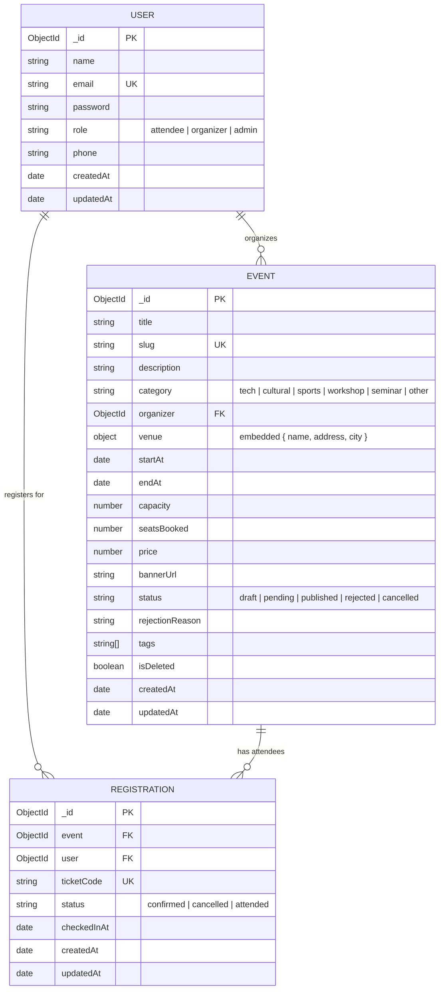

# MongoDB Data Layer Schema Specification

This document provides a technical specification of the MongoDB data layer designed for **EventHub / Event Management Portal**. It describes the data models, field definitions, enums, indexes, design decisions (embedding vs. referencing), and an Entity-Relationship (ER) diagram.

---

## 1. Entity-Relationship (ER) Diagram

---

## 2. Models & Schema Definitions

### 2.1 User Model (`src/models/User.js`)

Represents registered users across the platform with role-based access levels (`attendee`, `organizer`, `admin`).

| Field | Type | Modifiers / Constraints | Description |
| :--- | :--- | :--- | :--- |
| `_id` | `ObjectId` | Primary Key, Auto-generated | Unique user identifier |
| `name` | `String` | `required`, `trim` | Full name of the user |
| `email` | `String` | `required`, `unique`, `lowercase`, `trim`, Regex validated | User's login email address |
| `password` | `String` | `required`, `select: false`, `minlength: 8` | Bcrypt hashed password |
| `role` | `String` | `enum: ['attendee', 'organizer', 'admin']`, default: `'attendee'` | System authorization role |
| `phone` | `String` | `trim` | Contact phone number |
| `createdAt` | `Date` | Mongoose Timestamp | Record creation timestamp |
| `updatedAt` | `Date` | Mongoose Timestamp | Record last updated timestamp |

#### Hooks, Methods & Transforms
- **Pre-save Hook**: Hashes modified passwords using `bcryptjs` (10 salt rounds).
- **Instance Method**: `comparePassword(candidate)` returns a boolean Promise comparing raw input against stored hash.
- **toJSON Transform**: Automatically strips `password` and `__v` from query responses.

---

### 2.2 Event Model (`src/models/Event.js`)

Represents an event created by an organizer.

| Field | Type | Modifiers / Constraints | Description |
| :--- | :--- | :--- | :--- |
| `_id` | `ObjectId` | Primary Key, Auto-generated | Unique event identifier |
| `title` | `String` | `required`, `trim` | Human-readable title |
| `slug` | `String` | `required`, `unique`, `lowercase`, `trim` | URL-safe slug identifier |
| `description` | `String` | `required`, `trim` | Detailed description of the event |
| `category` | `String` | `required`, `enum: ['tech', 'cultural', 'sports', 'workshop', 'seminar', 'other']` | Event classification |
| `organizer` | `ObjectId` | `required`, `ref: 'User'`, `indexed` | Reference to User who created the event |
| `venue` | `Object` | Embedded `{ name, address, city }` | Physical location details |
| `startAt` | `Date` | `required` | Event start date and time |
| `endAt` | `Date` | `required`, **Custom Validator** (`endAt > startAt`) | Event completion date and time |
| `capacity` | `Number` | `required`, `min: 1` | Total seat capacity |
| `seatsBooked` | `Number` | `default: 0`, `min: 0` | Total registered seats |
| `price` | `Number` | `default: 0`, `min: 0` | Ticket cost in currency |
| `bannerUrl` | `String` | `trim` | URL link to cover image |
| `status` | `String` | `enum: ['draft', 'pending', 'published', 'rejected', 'cancelled']`, default: `'pending'` | Event approval status |
| `rejectionReason` | `String` | `trim` | Reason if status is rejected by admin |
| `tags` | `[String]` | Array of `String` | Keywords for search & discovery |
| `isDeleted` | `Boolean` | `default: false` | Soft-delete flag |
| `createdAt` | `Date` | Mongoose Timestamp | Record creation timestamp |
| `updatedAt` | `Date` | Mongoose Timestamp | Record last updated timestamp |

#### Virtuals & Validators
- **Virtual Property**: `seatsRemaining` calculates `capacity - seatsBooked` dynamically.
- **Custom Validator**: Validates that `endAt` is chronologically later than `startAt`.
- **Indexes**: Compound index `{ category: 1, status: 1, startAt: 1 }` for optimized query filters.

---

### 2.3 Registration Model (`src/models/Registration.js`)

Junction model representing an attendee's ticket reservation for an event.

| Field | Type | Modifiers / Constraints | Description |
| :--- | :--- | :--- | :--- |
| `_id` | `ObjectId` | Primary Key, Auto-generated | Unique registration identifier |
| `event` | `ObjectId` | `required`, `ref: 'Event'`, `indexed` | Reference to registered Event |
| `user` | `ObjectId` | `required`, `ref: 'User'`, `indexed` | Reference to attendee User |
| `ticketCode` | `String` | `required`, `unique`, `uppercase`, `trim` | Unique QR/ticket code |
| `status` | `String` | `enum: ['confirmed', 'cancelled', 'attended']`, default: `'confirmed'` | Ticket status |
| `checkedInAt` | `Date` | Optional timestamp | Timestamp when attendee checked in |
| `createdAt` | `Date` | Mongoose Timestamp | Ticket issuance timestamp |
| `updatedAt` | `Date` | Mongoose Timestamp | Last status change timestamp |

#### Indexes & Hooks
- **Compound Index**: `{ event: 1, user: 1 }` with `{ unique: true }` prevents double booking.
- **Pre-save Hook**: Automatically formats `ticketCode` to uppercase.

---

## 3. Data Architecture Decisions: Embedded vs Referenced

### 3.1 Embedded Subdocuments

#### `venue` inside `Event`
- **Decision**: Embedded directly within `Event` as a subdocument (`{ name, address, city }`).
- **Rationale**:
  1. **Tightly Bound**: Venue information is strictly queried alongside event details when rendered on the portal.
  2. **Atomic Reads**: Eliminates additional `$lookup` / query joins when retrieving event cards or details pages.
  3. **No Standalone Lifecycle**: Venue entries in this schema do not possess independent lifecycle management.

---

### 3.2 Referenced Relationships

#### `organizer` in `Event` (`User` Reference)
- **Decision**: Stored as a reference (`ObjectId` pointing to `User`).
- **Rationale**:
  1. **Entity Independence**: Users have independent lifecycles (authentication, role changes, profile updates).
  2. **Data Duplication Avoidance**: Embedding organizer details inside every created event would lead to stale data if an organizer updates their phone or name.
  3. **Document Size**: Keeps `Event` documents lean.

#### `Registration` Junction Model
- **Decision**: Separate referenced collection linking `User` and `Event`.
- **Rationale**:
  1. **Unbounded Growth**: Embedding registrations directly into an `Event` array (`event.registrations = [...]`) risks exceeding MongoDB's 16MB document size limit for large events.
  2. **Independent Operations**: Ticket check-ins, status cancellations, and user registration histories can be queried and modified concurrently without write-locking the main `Event` document.
  3. **Atomic Counter**: `Event.seatsBooked` is updated atomically via `$inc`, keeping read queries fast while `Registration` tracks detailed ticket audit logs.
